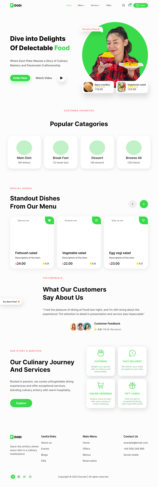

# Restaurant VueJS App

### I used the UI from the Figma website.
#### [UI Design](https://www.figma.com/file/oFVK4ormdKxtvxiyXjfAza/Restaurant-Website-UI-Template-(Community)?type=design&node-id=0%3A1&mode=design&t=08SzVRgWvY72KCon-1)




## Project setup

```
npm install
```

### Compiles and hot-reloads for development or Run The Project

```
npm run serve
```

### Compiles and minifies for production

```
npm run build
```

### Run your unit tests

```
npm run test:unit
```

### Lints and fixes files

```
npm run lint
```

### Customize configuration

See [Configuration Reference](https://cli.vuejs.org/config/).
